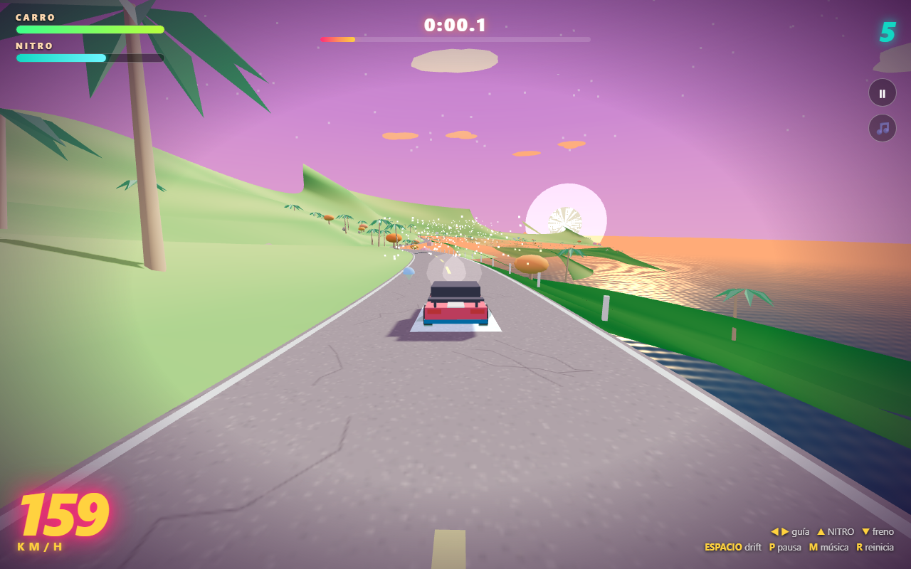
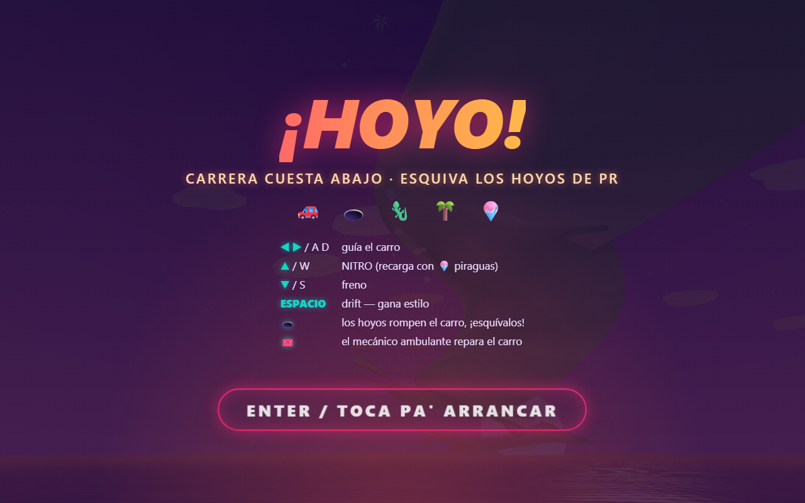

# ¡HOYO! 🕳️🚗

**Carrera cuesta abajo por Puerto Rico — esquiva los hoyos, las iguanas y el tapón.**

A high-speed downhill arcade racer built with Three.js/WebGL. Race a 3.6 km
mountain road from the cordillera down to the beach at 230 km/h while dodging
the island's most authentic hazard: potholes.

## Play

**No build, no server, no dependencies** — everything is vendored/synthesized:

- **Desktop:** open `index.html` in any browser
- **Phone / single file:** open `hoyo-game.html` (the whole game bundled into
  one HTML file with touch controls)

## Controls

| Desktop | Mobile | Action |
| --- | --- | --- |
| ← → / A D | ◀ ▶ | steer |
| ↑ / W | 🔥 | nitro (piraguas 🍧 refill it) |
| ↓ / S | 🛑 | brake |
| SPACE (or brake+steer) | 🛑 + ◀▶ | drift — style points |
| P / ESC | ⏸ | pause |
| M | 🎵 | music on/off |
| R | tap | restart |

## The game

- **~150 potholes** in clusters, each with one tight gap — hits damage the car
  by size and speed. Health at zero: **¡TE PONCHASTE!**
- **Iguanas** dart across when they hear you coming; slow **tapón** traffic must
  be overtaken at speed
- **Near-miss combos** — shave past holes and cars to build up to a x5 multiplier
- **Piraguas** 🍧 refill nitro, the **mecánico ambulante** 🧰 repairs the car
- Drift leaves real skid marks and cashes out as **¡WEPA!** style points
- **Records** (best score / best time) persist in localStorage
- Fully synthesized audio: dembow beat, engine, wind, skids, and coquí chirps —
  zero audio assets

## Tech

- Three.js r128 (vendored, runs from `file://`)
- Procedural everything: seeded track generation, terrain, GLSL water shader
  with animated waves, canvas-generated textures (asphalt, PR flag, sky)
- ACES tone mapping, real-time shadows, drift smoke, pothole dust
- `?autoplay` query param = smoke-test mode (drops in mid-run at speed);
  `?touch` forces the mobile UI

## Native iOS port

`HoyoSwift/` contains a complete SwiftUI + SceneKit port (same seeded track,
same physics, plus haptics) ready to build in Xcode on a Mac — see
[HoyoSwift/README.md](HoyoSwift/README.md). It also includes an optional
WKWebView wrapper that ships the JS game as an app instead.

