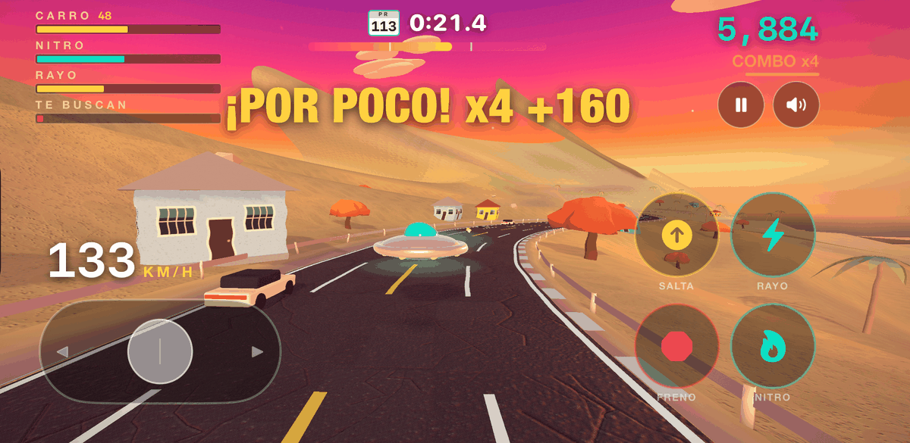
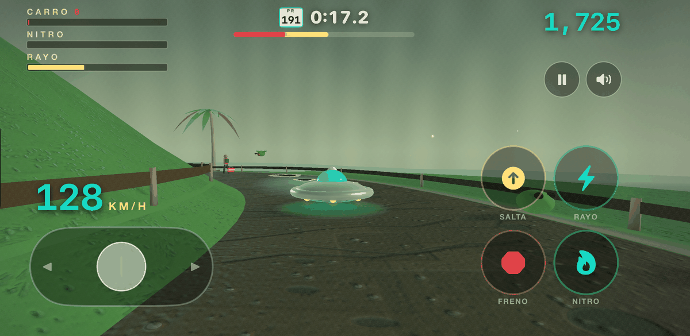
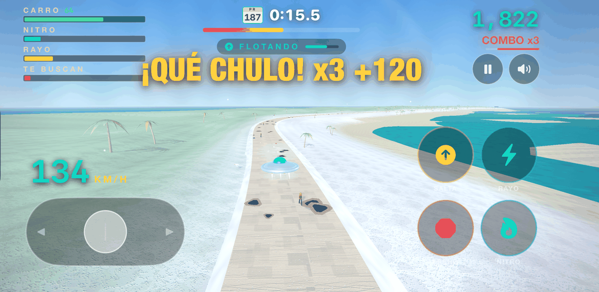
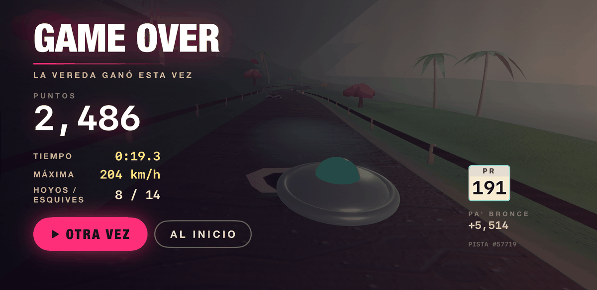
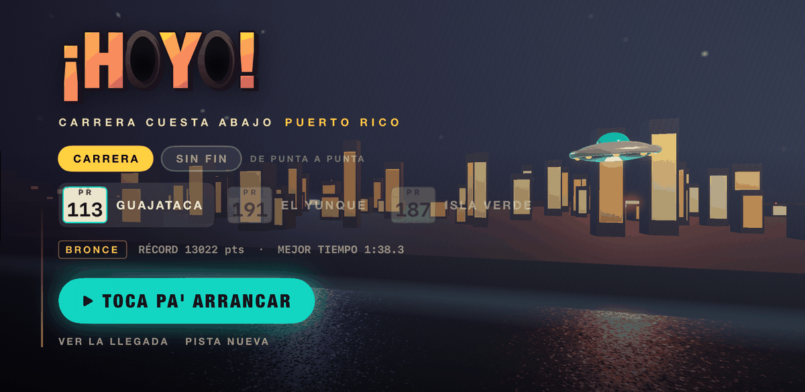
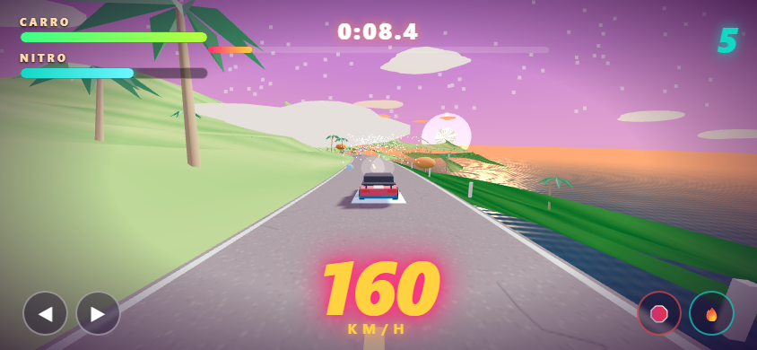

# ¡HOYO! 🕳️🛸

**Carrera cuesta abajo por Puerto Rico — esquiva los hoyos, las iguanas y el tapón.**

You fly a stolen flying saucer down three Puerto Rican courses at 200 km/h, dodging
the island's most authentic hazard: potholes.

There are two builds in this repo. The **native iOS app** is the real game and where
all the work goes. The **browser version** is the original, still playable, and needs
nothing but a double-click.

| | What it is | How to run it |
| --- | --- | --- |
| **`HoyoSwift/`** | Native SwiftUI + SceneKit. Three courses, medals, ghost replays, haptics. | Xcode 15+ on a Mac — see [HoyoSwift/README.md](HoyoSwift/README.md) |
| **`index.html`** | The original Three.js/WebGL car racer. One course. | Open it in any browser. No build, no server, no dependencies. |

---

## The native game

Three courses, each a real road, unlocked by finishing the one before it.

| | Course | Road | Surface |
| --- | --- | --- | --- |
| 1 | **GUAJATACA** — *bajada por el karso* | PR-113 | four lanes of asphalt through the karst and a pueblo |
| 2 | **EL YUNQUE** — *vereda en el bosque* | PR-191 | a single-track dirt trail under rainforest canopy |
| 3 | **ISLA VERDE** — *orilla y arena mojada* | PR-187 | wet sand along the shoreline, no guardrail |

### What you do

- **~150 potholes** in clusters, each cluster with one tight gap. Hits damage the
  craft by size and speed. At zero: **¡TE PONCHASTE!**
- **Jump** clears a pothole outright and scores big over a car's roof
- **Rayo** — a beam that seals potholes under a fresh tar patch and knocks cars out
  of the lane. Two shots, then about 4.6 seconds a shot
- **Ram a car** above 16 m/s of closing speed and you parry it aside instead of
  bouncing off. Worth more against a police cruiser
- **Brake + steer = drift**, which lays real skid marks and cashes out as **¡WEPA!**
- **Near-miss combos** up to x5 — but holding a big combo builds **heat**, and heat
  brings **la policía**, who hunt you
- **Piraguas** 🍧 refill nitro; the **mecánico ambulante** 🧰 repairs the craft
- **Iguanas** dart across when they hear you coming; slow **tapón** traffic has to be
  overtaken

### What you keep

- **Medals** — bronce, plata, oro — per course, on measured score thresholds
- **Ghost replays**: your best run comes back as a translucent saucer to race
- **Endless mode** (*sin fin*) once you want to lap it until the craft gives out
- Records persist in `UserDefaults` behind a **versioned save schema**, so changing
  the scoring economy retires old scores instead of quietly lying about them

### Zero asset files

Everything is generated at launch or computed per pixel. There is not one image or
audio file in the bundle.

- **Textures** drawn in Core Graphics: asphalt with 13,000 aggregate specks, tar seams
  and hairline cracks; packed dirt; wet sand; casita facades with rejas; the PR flag
- **Normal maps** derived from those textures' own luminance by Sobel, so the relief
  lines up with the grain you can actually see
- **Sky** as a procedural cubemap in four moods — sunset, rainforest, tropical, night
- **Props** as generated meshes with colour in the vertex stream: palms with curved
  tapering trunks, flamboyán crowns that self-shade, faceted boulders
- **Audio** synthesized by AVAudioEngine: the dembow beat, engine, wind, skids, surf
  and coquí chirps, all from maths
- **Post-processing** through a Metal `SCNTechnique`: a per-course colour grade, plus
  heat shimmer over the sun-baked asphalt on Guajataca

---

## The browser version

The original, and still the fastest way to see it: open `index.html`. It's a car, not
a saucer, on a single 3.6 km course.

- **Desktop:** `index.html`
- **Phone, single file:** `hoyo-game.html` — the whole game in one HTML file with
  touch controls

| Desktop | Mobile | Action |
| --- | --- | --- |
| ← → / A D | ◀ ▶ | steer |
| ↑ / W | 🔥 | nitro |
| ↓ / S | 🛑 | brake |
| SPACE (or brake+steer) | 🛑 + ◀▶ | drift |
| P / ESC | ⏸ | pause |
| M | 🎵 | music |
| R | tap | restart |

Three.js r128 is vendored so it runs from `file://`. `?autoplay` drops you in mid-run
at speed; `?touch` forces the mobile UI.

> The two builds have diverged a long way. The native version is a different game with
> the same soul — the browser one is kept because it still works and costs nothing.
